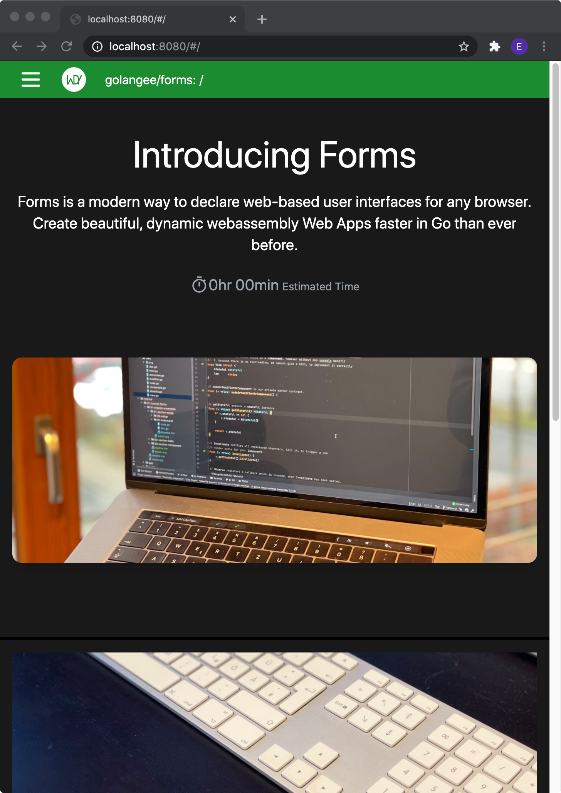

# gotrino-tutorial

Package gotrino-tutorial contains a wasm frontend application which show the usage and best 
practices of gotrino.

## Usage

Either visit http://gotrino.golangee.org/ to see it live or compile and run it on your own.
Ensure that you have the latest *[gotrino-make](https://github.com/golangee/gotrino-make)* installed.

```
# checkout
mkdir -p ~/tmp/gotrino-tutorial
cd ~/tmp/gotrino-tutorial
git clone https://github.com/golangee/gotrino-tutorial .

# re-generate the tutorial assets
go generate ./...

# run it with hot reloading
gotrino-make serve
```

<p align="center">
  
</p>