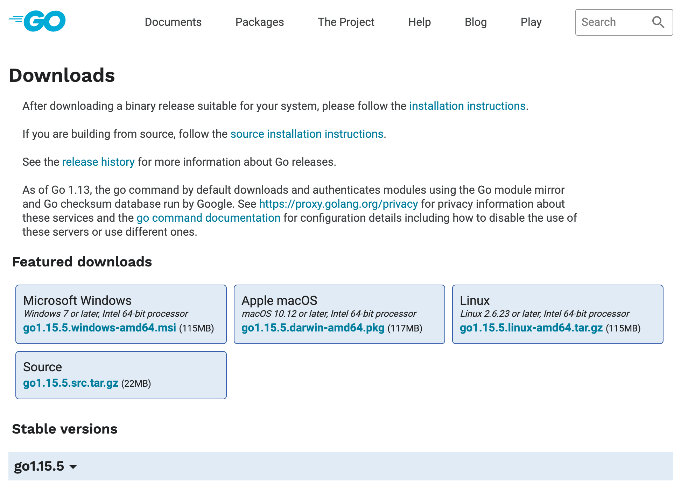

# Step 1

To set things up, first ensure that you have a recent Go SDK installation. This tutorial has been tested
with [Go 1.15](https://golang.org/dl/). *Go* development is really fun with a good IDE. We recommend
[Goland](https://www.jetbrains.com/go/), to have a hassle-free and productive time.

## Attachments

[iframe](/c01s01s01)

[source](component.go)